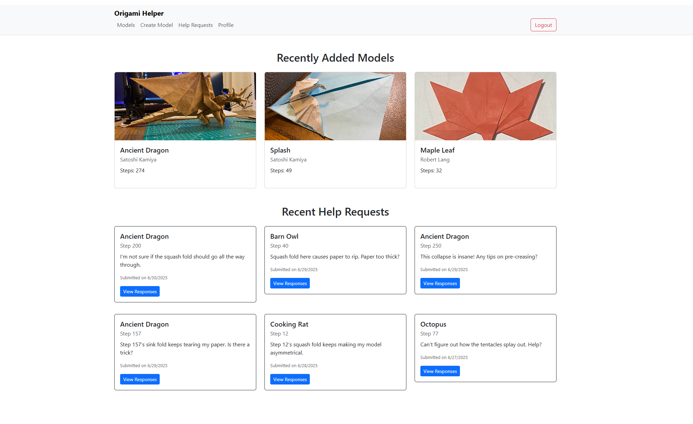
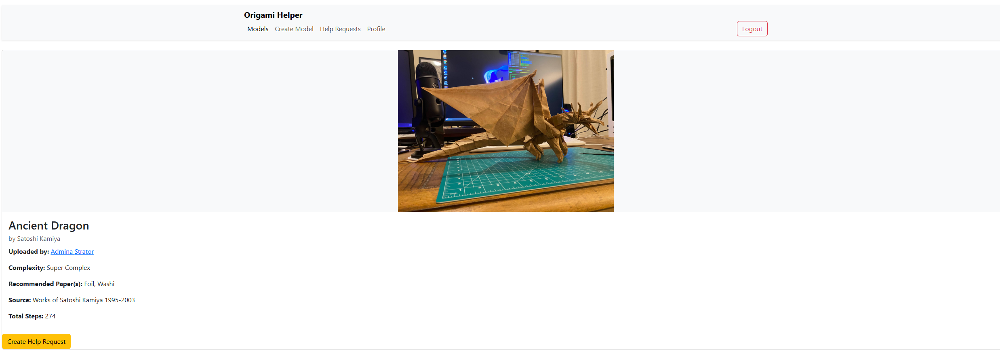
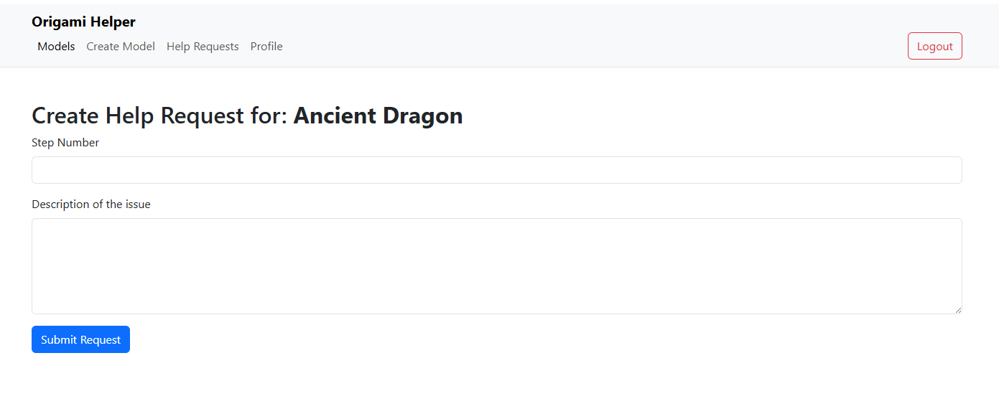

````md
# 🦢 Origami Helper

**Origami Helper** is a full-stack web application that allows origami enthusiasts to share their models, request help with tricky steps, and respond to others' questions using video walkthroughs. Whether you're a beginner stuck on a squash fold or a veteran guiding others through complex sink folds, Origami Helper fosters a helpful and creative community.

---

## 🌟 Features

- **User Authentication**: Register/login securely using cookie-based authentication.
- **Model Uploads**: Add your origami models with images, step counts, and details like paper type, complexity, and source.
- **Help Requests**: Stuck on a specific step? Post a request for assistance.
- **Video Responses**: Respond to help requests with recorded videos.
- **Media Hosting**: Supports both image and video uploads from users' machines.

---

## 🛠 Getting Started

### 1. Clone the Repository

```bash
git clone https://github.com/yourusername/origami-helper.git
cd origami-helper
````

### 2. Install Client Dependencies

```bash
cd client
npm install
```

### 3. Debug the API

Ensure you are running the `.NET` backend in debug mode using your IDE or the following command:

```bash
dotnet run
```

Make sure the backend is configured with a valid PostgreSQL connection string in your app settings.

### 4. Start the Client

```bash
npm run dev
```

Visit `http://localhost:5173` (or the port shown in the terminal) to use the app.

---

## 🧭 Usage Overview

### Uploading a Model

1. Navigate to **Models > Create Model**
2. Fill in details like title, artist, source, and complexity.
3. Upload an image of your model.

### Requesting Help

1. View a model’s page and click **Request Help**
2. Select the step number and describe your issue.

### Responding with Video

1. Go to **Help Requests**
2. Click on a request and choose **Add Response**
3. Upload a video showing how to complete the step.

---

## 🖼 Screenshots





---

## ⚙ Tech Stack

* **Frontend**: React, React Router, Reactstrap
* **Backend**: ASP.NET Core, Entity Framework Core
* **Database**: PostgreSQL
* **Auth**: ASP.NET Identity, Cookie Auth
* **Media**: Static file serving for images and videos

---

## 🔒 Admin Account (Seeded)

```bash
Email: admina@strator.comx
Password: (Set via app settings under `AdminPassword`)
```

---

## 📁 Project Structure

```
/client        => React frontend
/Images        => Uploaded model images
/Videos        => Uploaded help response videos
/Data          => EF Core database context
```

---

## 📌 Notes

* Default seeded users: `origamifan1`, `paperfolder` with password `Origami123!`
* Application automatically serves static media via `/Images` and `/Videos` routes.

```

```
